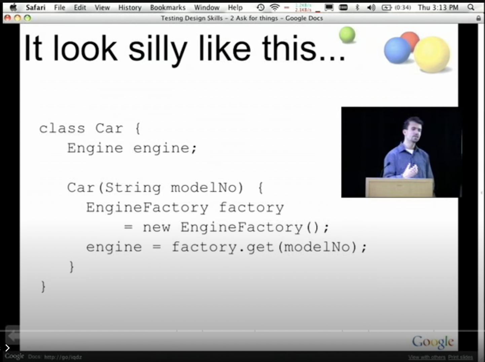
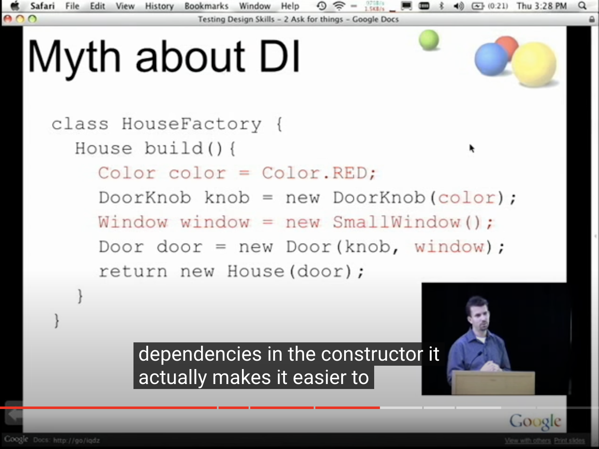

Title: Dependency injection pitfall
Date: 2023-02-18 22:37
Category: Design Pattern
Tags: DI, Design Pattern, Dependency Injection, Pitfall


> Let's sum it up: Don't bother trying to understand dependency injection, just do things the way you think is more "correct".

If you don't know DI before, the lecture below is a starting point:

* [The Clean Code Talks - Don't Look For Things! (a talk by Miško Hevery)](https://www.youtube.com/watch?v=RlfLCWKxHJ0)

And this post was written to show that you don't need to use the DI pattern specifically :-)

## Dependency injection in wiki’s definition

In software engineering, dependency injection is a design pattern in which an object or function receives other objects or functions that it depends on. A form of inversion of control, dependency injection aims to separate the concerns of constructing objects and using them, leading to loosely coupled programs. The pattern ensures that an object or function which wants to use a given service should not have to know how to construct those services. Instead, the receiving 'client' (object or function) is provided with its dependencies by external code (an 'injector'), which it is not aware of. Dependency injection helps by making implicit dependencies explicit and helps solve the following problems:
* How can a class be independent from the creation of the objects it depends on?
* How can an application, and the objects it uses support different configurations?
* How can the behavior of a piece of code be changed without editing it directly?
In addition, dependency injection is used for keeping code in-line with the dependency inversion principle.
Fundamentally, dependency injection consists of passing parameters to a method.

## An example of dependency injection: car factory

Concept is vague, let’s see the silly example described in `The Clean Code Talks` video first.




The python version is here:
```python
class Car:
    def __init__(self, modelNo: int):
        self.engine = EngineFactory.get(modelNo)
```

So the point that the speaker thought was stupid: the car shouldn't know about the engine factory, and the car shouldn't know how to make it. OK, let's expand this silly example a bit further.

```python
class Engine:
    @staticmethod
    def create(modelNo: int) -> Engine:
        engine = Engine(**fetchEngineParameters(modelNo))
        return engine
    
class Wheel:
    @staticmethod
    def create(modelNo: int) -> Wheel:
        wheel = Wheel(**fetchWheelParameters(modelNo))
        tire = Tire(**fetchTireParameters(modelNo))
        wheel.setTire(tire)
        return wheel

class Car:
    def __init__(self, modelNo: int):
        self.engine = Engine.create(modelNo)
        self.wheels = [Wheel.create(modelNo) for i in range(4)]
```

In the speaker's opinion, this should be even more stupid, because not only does Car know how to make its own engine and wheels, but Wheel also knows how to make its own tires.

But is it stupid? For the real world, yes! But that's just my code, I can made my car a Transformer who knows how to compose itself, that's cool. After all, it's just a bunch of information moving around on my computer, so it is not necessary to mimic the real world process(each part of the car is dumb and no subjective initiative, only humans with hands and minds or robots that also have hands and "minds" to do the manufacturing work). Not to mention writing more code for this.



Let's write this example on DI (Dependency Injection aims to separate the concerns of building objects and using them):

```python

class Car:
    def __init__(self, engine, wheels):
        self.engine = engine
        self.wheels = wheels

class EngineFactory:
    @staticmethod
    def build(modelNo: int) -> Engine:
        ...
        return engine

class TireFactory:
    @staticmethod
    def build(modelNo: int) -> Tire:
        ...
        return tire

class WheelFactory:
    @staticmethod
    def build(modelNo, tire) -> Wheel:
        ...
        return wheel


class CarFactory:
    @staticmethod
    def build():
        # dependency injection aims to separate the concerns of constructing objects and using them
        modelNumber = 101607
        engine = EngineFactory.build(modelNumber)
        tires = [TireFactory.build(modelNumber) for i in range(4)]
        wheels = [WheelFactory.build(modelNumber, tire) for tire in tires]
        car = Car(engine, wheels)
        return car
```


## And here is our Transformer: the counterpart of factory

```python

# database.py
class Database:
    # database stores paramters of everything
    def fetchEngineParameters(self, modelNo: int):
        # ... db.fetch
        return {...}

    def fetchTireParameters(self, modelNo: int):
        # ... db.fetch
        return {...}

    def fetchWheelParameters(self, modelNo: int):
        # ... db.fetch
        return {...}

DB = Database("tcp://...")

# car.py
class Car:
    def __init__(self, modelNo: int):
        self.engine = Engine(**DB.fetchEngineParameters(modelNo))
        self.wheels = []
        for i in range(4):
            tire = Tire(**DB.fetchTireParameters(modelNo))
            wheel = Wheel(**DB.fetchWheelParameters(modelNo))
            wheel.setTire(tire)
            self.wheels.append(wheel)

car = Car(modelNo)
```


## In my opinion (-_-)

1. Dependency Injection is just a formal term describing the way method parameters are designed in our day-to-day programming and should not be suggested as a good design pattern.

2. Dependency Injection makes the dependency relationships more explicit just IN CODE! You can also WRITE A GOOD DOCUMENT describing how system works instead of using a complicated dependency injector framework library, learn a lot of concept and write more complicated code just for applying it.
