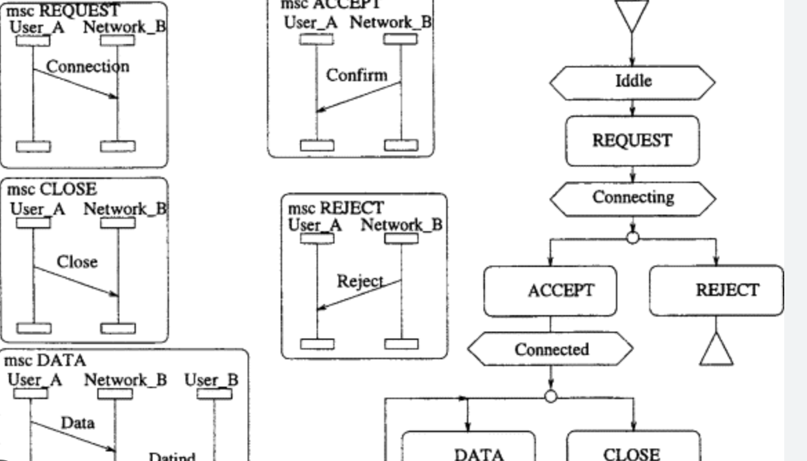
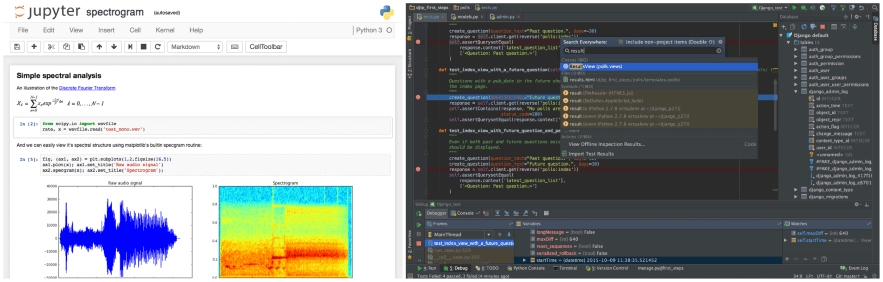

Title: IDE vs Notebook
Date: 2023-03-20 22:09
Category: Product
Tags: Product

Why do I like to use Pycharm/VScode to develop software, but use Jupyter to analyze and transform data?

This question pop out of nowhere, when I subconsiouly open Jupyter to do some experiments on DAP. So its been long time before i used Jupyter do some XML dataset analysising and transforming data. After that i have been using PyCharm to develop application. 

So things can be deduced from the following question:

* Users use the specific tools to SAVE TIME when solving problem, so what most time effected thing ?
* Why is one problem is easy for one tool to solve but bitter for the other ?

## Time is Most Previous Thing
If there is a powerful artificial intelligence that can do everything for you, you can forget about using any kind of tool and go spend time with your family. Unfortunately, there is no such AI that can completely replace human work, so we tend to use tools that make our lives easier to solve problems. Let's see what we spend the most time doing during software development: Design and Debug. (assuming we have a good understanding of the requirements and a good understanding of what the expected outcome is, if not then it's not a coding problem but a problem definition problem)

## Different Properties of Declarative and Structural Programming
Design and debug activities vary across programming paradigms. I know this categorization is biased, but let's roughly categorize two different programming paradigm below:

### Properties of Declarative Programming

> Express the logic of a computation without describing its control flow.

In declerative programming each declration statement has input and output, there is few states(innner variables) and control flow like loop and branching is kinda not recommanded(even forbidden). In declarative programming, the programmer specifies what they want the program to accomplish, rather than explicitly specifying how to accomplish it. This makes it well-suited for scientific computing, where computations can be very complex and difficult to implement using traditional procedural programming techniques, where the structure of the language being processed is often complex and difficult to express, make data analysis and transformation tasks more concise and easier to understand. So declarative programming is most powerful tool for those that involve complex computations or data processing.

### Properties of Structual Programming

> Uses structures such as subroutines, block structures, for loops, and while loops to replace traditional goto. In other language: control flow matters.

Structural programming is a programming paradigm that emphasizes the use of structured control flow constructs, such as loops and conditionals, to control the flow of execution within a program. The idea is to replace unstructured control flow constructs, such as GOTO statements, with structured constructs that are easier to read, understand, and maintain.

### Timeline is Crucial

In my other take on the difference between declarative and structural programming, the TIMELINE is crucial to the problem we are trying to solve. Declarative programming emphasizes what the program should do, rather than how it should do it. This can be beneficial in situations where the problem being solved can be described in terms of a set of rules or constraints. For example, in the case of a database query, the programmer may specify the criteria for selecting data, but leave it to the database engine to determine the most efficient way to retrieve that data. On the other hand, structured programming emphasizes the use of structured control flow constructs to control the flow of execution within a program. This can be beneficial in situations where the problem being solved involves complex algorithms or requires a specific sequence of operations. For example, event-driven software like our UI based application or network protocol stack which is basically a looped nested statemachine. The choice between declarative and structured programming depends on the nature of the problem being solved, as well as the requirements and constraints of the project. A programmer may choose declarative programming when the problem can be described in terms of rules or constraints, and structured programming when the problem requires a specific sequence of operations.

## Different Workflow of Declarative and Structural Programming

The natural working loop is Plan Do Check Adjust 4 steps loop. The different approach of this same loop on declarative and strutual programmings are:

### Workflow of Declerative programming

> Declerative programming is naturally interactive because each statement command line can be evaluated individually, and the result of each statement can be returned immediately and inspected by the user.

This is especially common in data processing workflows, where the user deals with highly complex data structures or vague and related data, and it is not clear how to build the data processing pipeline at the beginning, so he/she can only build it step by step, evaluating each statement or command line as they go, and inspecting the results before moving on to the next step. This allows the programmer to explore different directions and try different approaches to see what works best, without losing the progress they have made so far. 

> It's like walking a maze, you take the map you've explored with you (in terms of coding, you don't want to lose the data you've got so far by re-running the program) and continue exploring the maze from this point.  The ability to evaluate each statement or command line individually can also be useful for debugging purposes. If an error occurs, the programmer can inspect the result of the previous statements or command lines to see where the error occurred and what might have caused it.

So the workflow of declerative programming usually is non-linear.

### Workflow of Strutual programming
> In structured programming, the workflow is typically more rigidly defined compared to declarative programming. The code is usually organized into subroutines, functions, or modules, which are then called in a specific sequence to perform a particular task or solve a specific problem. 

The use of structured control flow constructs, such as loops and conditionals, helps to ensure that the program follows a specific path and that the code is executed in a specific order. Unlike declarative programming, where the pipeline for processing data may not be immediately clear, structured programming usually requires a clear understanding of the problem being solved and the steps needed to solve it. The workflow is typically defined at the beginning of the project and may be modified as needed based on feedback or changes in requirements, but the basic structure of the program remains relatively constant. Structured programming can be more efficient than declarative programming in certain situations, especially when the problem being solved involves complex algorithms or requires a specific sequence of operations. By controlling the flow of execution through the use of structured control flow constructs, structured programming can ensure that the program runs quickly and efficiently, without unnecessary computations or steps.

> Structured programming could be like building a house. Each step in the building process, such as laying the foundation, framing the walls, and installing the roof, represents a subroutine or module in the code. The use of structured control flow constructs helps to ensure that the steps are executed in the correct order, just like how the building process requires a specific sequence of steps. As with building a house, the workflow in structured programming is typically defined at the beginning of the project and may be modified as needed, but the basic structure of the program remains relatively constant. By following a structured approach to building a house or writing code, the builder or programmer can produce a consistent and reliable outcome.

So the workflow of strutual programming usually is linear.

## References:
* https://towardsdatascience.com/5-reasons-why-jupyter-notebooks-suck-4dc201e27086