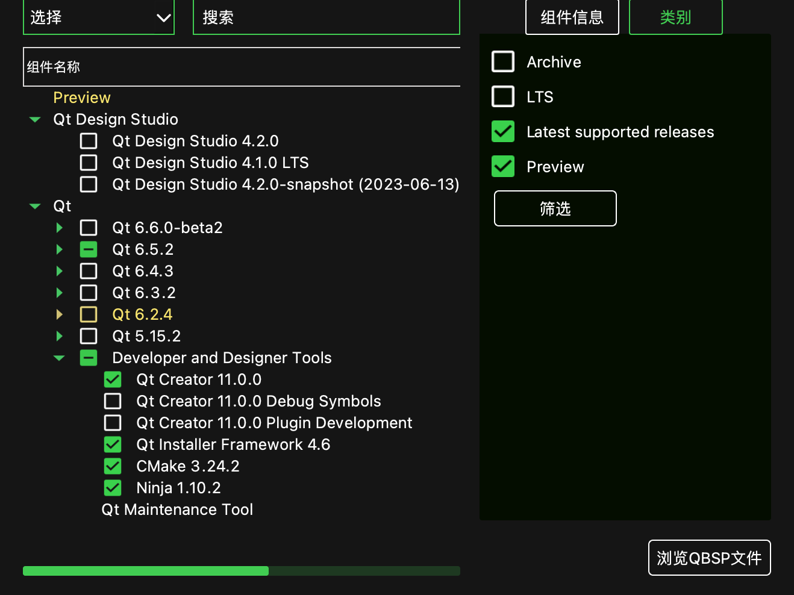
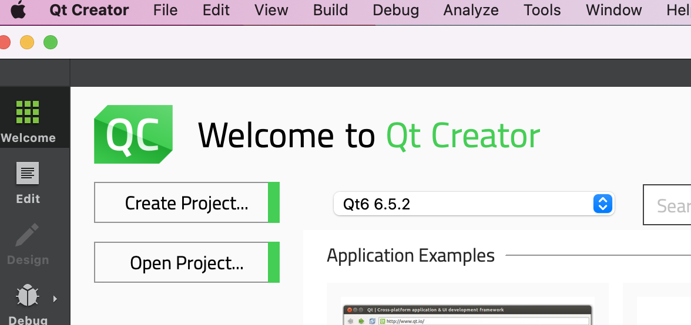
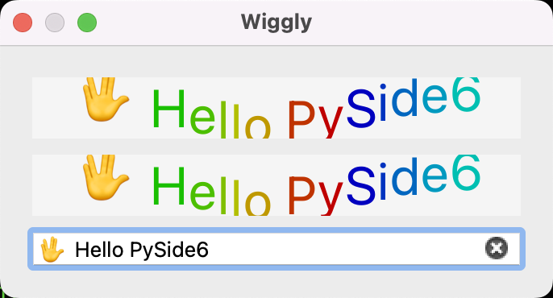

Title: Generates Python bindings for the Qt6 library with PySide6 on MacOS
Date: 2023-07-29 15:23
Category: Qt
Tags: Qt, PySide6, Python

I've been using PyQt5 for years which is de facto standard Qt python binding library until PySide2 has been offically 
announced up by the Qt Company in year of 2018. Five years on, I think PySide is mature enough to be used in production
environment. This post request you to have C++ and compiler toolchain knowledge, since I won't explain much about details of CMake syntax and C++ build system.

# Walkthrough examples on MacOS 
## Install Qt environment

If you won't modify Qt C++ source, it is recommanded to install Qt pre-build by download qt installer online and install 
Qt by clicking next till end. Intaller can be download under https://www.qt.io/download-open-source.

> CAUTION: You MUST install Qt same version as PySide! Otherwise the abi consistancy is doomed.

The latest Qt version at the time of writing is 6.5.2 , we will stick to this version here.



You can check which version of Qt you have installed on system.


If you can see Qt installed under `/User/XXX/Qt/6.5.2/`, it means you can proceed.

## Requirements

* XCode 8.2 (macOS 10.11), 8.3.3 (macOS 10.12), 9 (macOS 10.13), 10.1 (macOS 10.14) or XCode build tools.
* CMake == 3.27.1 (de facto cross-platform C/C++ build system for other build systems)
* Ninja == 1.11.1 (the famous tool `make`'s modern alternative)
* `sphinx` package for the documentation (optional).
* Depending on your OS, the following dependencies might also be required: 
    libgl-dev, python-dev, python-distutils, and python-setuptools.

I am get used to `Anaconda` environment, its the same of you to use `virtualenv`.

Create a new python environment using Python 3.11 (PySide6 only supports Python > 3.8 and it's no difference to use 
3.9, 3.10, 3.11), I use 3.11 because it is latest Python version at the time of writing.

> ```conda create --name pyside python=3.11```
> ```ninja --version```
> ```cmake --version```

If everything works fine and no output complains about missing something then you can proceed.

## Install PySide6!

There is easy way and hard way to install PySide6 in your python environment.

1. Easy way: `pip install PySide6`. Done!
2. Hard way: Man you are brave enough! Lets do this.

### Download PySide source code! (Hard trip)

#### Cloning the official repository can be done by:
> `git clone https://code.qt.io/pyside/pyside-setup`

#### Checking out the version that we want to build, for example, 6.5.2:
> `cd pyside-setup && git checkout 6.5.2`

#### Install the general dependencies:
> `pip install -r requirements.txt`

> NOTE: Keep in mind you need to use the same version as your Qt installation

#### Building PySide

Check your Qt installation path, to specifically use that version of qtpaths to build PySide. for example, `/User/XX/Qt/6.5.2/macos/bin/qtpaths`. (This `qtpaths` is a small program to get locations of Qt)

Build can take a few minutes, so it is recommended to use more than one CPU core:

`python setup.py build --qtpaths=/User/XX/Qt/6.5.2/macos/bin/qtpaths/qtpaths --build-tests --ignore-git --parallel=8`

#### EWWWWW... ISSUE MET! (Hard trip)

```
CMake Error at cmake/ShibokenHelpers.cmake:170 (find_package):
  Could not find a package configuration file provided by "Clang" with any of
  the following names:

    ClangConfig.cmake
    clang-config.cmake

  Add the installation prefix of "Clang" to CMAKE_PREFIX_PATH or set
  "Clang_DIR" to a directory containing one of the above files.  If "Clang"
  provides a separate development package or SDK, be sure it has been
  installed.
Call Stack (most recent call first):
  cmake/ShibokenSetup.cmake:38 (setup_clang)
  CMakeLists.txt:14 (include)
```

Since I have `CommandLineTools` installed instead of XCode.app, the CMake can not find my `Clang` correctly. (Clang is used for static CPP source file 
parse for syntax extraction used in binding source file generation).

```
$ mdfind -name libclang.dylib
/Library/Developer/CommandLineTools/usr/lib/libclang.dylib
```

I digged into CMake files and found this in `ShibokenHelper.cmake`:

```
macro(setup_clang)
    # Find libclang using the environment variables LLVM_INSTALL_DIR,
    # CLANG_INSTALL_DIR using standard cmake.
    # Use CLANG_INCLUDE_DIRS and link to libclang.
    if(DEFINED ENV{LLVM_INSTALL_DIR})
        list(PREPEND CMAKE_PREFIX_PATH "$ENV{LLVM_INSTALL_DIR}")
        list(PREPEND CMAKE_FIND_ROOT_PATH "$ENV{LLVM_INSTALL_DIR}")
    elseif(DEFINED ENV{CLANG_INSTALL_DIR})
        list(PREPEND CMAKE_PREFIX_PATH "$ENV{CLANG_INSTALL_DIR}")
        list(PREPEND CMAKE_FIND_ROOT_PATH "$ENV{CLANG_INSTALL_DIR}")
    endif()

    find_package(Clang CONFIG REQUIRED)
    # Need to explicitly handle the version check, because the Clang package doesn't.
    if (LLVM_PACKAGE_VERSION AND LLVM_PACKAGE_VERSION VERSION_LESS "9.0")
        message(FATAL_ERROR "You need LLVM version 9.0 or greater to build.")
    endif()

    # CLANG_LIBRARY is read out from the cmake cache to deploy libclang
    get_target_property(CLANG_BUILD_TYPE libclang IMPORTED_CONFIGURATIONS)
    get_target_property(CLANG_LIBRARY_NAME libclang IMPORTED_LOCATION_${CLANG_BUILD_TYPE})
    set(CLANG_LIBRARY "${CLANG_LIBRARY_NAME}" CACHE FILEPATH "libclang")
    message(STATUS "CLANG: ${Clang_DIR}, ${CLANG_LIBRARY} detected")
endmacro()
```
Which says `LLVM_INSTALL_DIR` path is used to find `libclang`, I set the environment variable, but still can't build it correctly, obviously, `find_package(Clang CONFIG REQUIRED)` needs CMake configuration file to work, so any Clang library 
without CMake configuration files can not be used.

Eventually I altered to method which is suggested in QtForPython Getting Started Tutorial > https://doc.qt.io/qtforpython-6/gettingstarted/macOS.html

> Setting up CLANG
> If you don’t have libclang already in your system, you can download from the Qt servers:

> `wget https://download.qt.io/development_releases/prebuilt/libclang/libclang-release_140-based-macos-universal.7z`
> Extract the files, and leave it on any desired path, and set the environment variable required:

> `7z x libclang-release_140-based-macos-universal.7z`
> `export LLVM_INSTALL_DIR=$PWD/libclang`

And it worked as expected. 

### Tips of pakcage installation. 

After you have built PySide2 project successfully, you will get Official PySide6 package under `qfp-py3.11-qt6.5.2-64bit-release` 
folder in `build` we create early. There is a lot of `Qt*.so` in `package/PySide6` that ready to be imported by your 
python script.

But before we use PySide6 in our python script, we must first install them into our `site-packages` for python 
executable to find. 

> You can use `python setup.py --help` to see the usage of commandline of setup tool.
> Or use `python setup.py --help-command` to see detailed argument usage.

The setup commandline tool is powerful, it can generate egg files, wheels and dist-info folder for package distribution. 
But here we just use `python setup.py install --qtpaths=/User/XX/Qt/6.5.2/macos/bin/qtpaths/qtpaths --build-tests --ignore-git --parallel=8` to install package with dist-info(stores meta information of package for usage).


### Test installation

You can execute one of the examples to verify the process is properly working. Remember to properly set the environment variables for Qt and PySide:

> `python examples/widgets/widgets/tetrix/tetrix.py`

## Write C++ generate Python bindings for usage.

### Level 1: Generate Python bindings for a non-Qt C++ library

> https://doc.qt.io/qtforpython-6/examples/example_samplebinding_samplebinding.html

There is a demo of non-Qt C++ library Python binding generation called `samplebinding` located at `PySide/examples/samplebinding`. 

You can practice this demo by reading the documentation under the folder `samplebinding/doc/samplebinding.rst`.

If you walkthrough the hard trip and built PySide6 your self, your toolchain environment is well 
configured to work properly on this demo. But if you install PySide6 using PIP, then you will need to install 
`shiboken6-generator` which can't be install throgh PIP and isn't included in the `PySide6` PIP installation. 
`shiboken6-generator` package wheel can be manually downloaded from website https://download.qt.io/official_releases/QtForPython/shiboken6-generator/ . Using `pip install shiboken6_generator-6.5.2-pp39-pypy39_pp73-macosx_10_9_universal2.whl` 
to install.

> If you build PySide6 from sources, besides `PySide6`, `shiboken6` and `shiboken6-generator` will also be compiled and 
> installed from source.

#### Apple M1 chip trouble shooting.

If you `python main.py` after successfully built the `libuniverse.dylib` and `Universe.so` Python binding library on 
Apple M1 chip. You would probably run into issue that complains about the `Universe.so` is `arm64` architectured but 
`x86_64` architectured library is expected. PySide6 you installed from PIP is `x86_64` architectured. But your 
project is built on `arm64` M1 chip so the program using `arm64` instruct set. 
Do we need "cross-compile" the library? 
It is normal to compile `arm64` program on `x86_64` platform if you are a embeded system engineer.
Is there reverse compiler we can use? 
The answer is YOU DONT NEED IT, the toolchain we have just installed can compile `x86` program since engineers in Apple 
work so hard to make every "Intel" based program running on M1 chip without rewrite code.

But still we need to set a CMake variable to instruct CMake generate project to compile to `x86_64`. 

```
cd examples/samplebinding
mkdir build
cd build
cmake -H.. -B. -G Ninja -DCMAKE_BUILD_TYPE=Release -DCMAKE_OSX_ARCHITECTURES=x86_64
ninja
ninja install
cd ..
```

The CMake variable `CMAKE_OSX_ARCHITECTURES` specific architectures for macOS.


## Level 2: Make a Qt C++ application scriptable

> https://doc.qt.io/qtforpython-6/examples/example_scriptableapplication_scriptableapplication.html

This example demonstrates how to make a Qt C++ application scriptable.
The exmaple document is really detailed, so you can walkthrough it easily.
In the end you will get a `scriptableapplication` which can be runned as an executable program.

This example is exactly the opposite of example "Level 1: Generate Python bindings for a non-Qt C++ library".

In previous example, we compile C++ into dynamic shared library together with loadable module and use C++ objects in 
Python runtime environment. But in this example, the direction is the opposite, it compiles C++ application and link 
against python library, embed python runtime context in it, so the Qt application actually invokes Python script.

## Level 3: Generate Python bindings for a Qt C++ library

Amazingly, we've gotten this far, and it's time to treat ourselves a little bit with a cup of coffee.

> This URL https://doc.qt.io/qt-6/qtwidgets-widgets-wiggly-example.html given in README is 404 not found now. 
> So lets explore it on our own.

According to README of this example, it shows how to interact with a custom widget from two
different ways:

 * A full Python translation from a C++ example,
 * A Python binding generated from the C++ file.

We only focus on the second in this post.

### Following the steps to build the bindings in README

> The most important files are:
> * `bindings.xml`, to specify the class that we want to expose from C++
>   to Python,
> * `bindings.h` to include the header of the classes we want to expose
> * `CMakeList.txt`, with all the instructions to build the shared libraries
>   (DLL, or dylib)
> * `pyside_config.py` which is located in the utils directory, one level
>   up, to get the path for Shiboken and PySide.

> Now create a `build/` directory, and from inside run `cmake` to use
> the provided `CMakeLists.txt`:

> macOS/Linux:
> ```bash
> cd ~/pyside-setup/examples/widgetbinding
> ```

> On Windows:
> ```bash
> cd C:\pyside-setup\examples\widgetbinding
> ```

> ```bash
> mkdir build
> cd build
> cmake -H.. -B. -G Ninja -DCMAKE_BUILD_TYPE=Release -DCMAKE_OSX_ARCHITECTURES=x86_64
> ninja
> ninja install
> cd ..
> ```

### `<QtCore.qglobal.h> not found` issue
Sadly, this demo project won't compile properly. The first issue we met is `<QtCore.qglobal.h> not found` error. 
This is weird since we have just built `scriptableapplication` which works fine. So we check the difference of their 
`CMakeLists.txt` files.

I found the error is somehow came from the specific QtCore include paths which are passed to shiboken. 
The code in `widgetbinding` example was not right.

```
> CMakeLists.txt of `widgetbinding` example, line 141~148

[141]: # On macOS, check if Qt is a framework build. This affects how include paths should be handled.
[142]: get_target_property(QtCore_is_framework Qt6::Core FRAMEWORK)
[143]: if (QtCore_is_framework)
[144]:     get_target_property(qt_core_library_location Qt6::Core LOCATION)
[145]:     get_filename_component(qt_core_library_location_dir "${qt_core_library_location}" DIRECTORY)
[146]:     get_filename_component(lib_dir "${qt_core_library_location_dir}/../" ABSOLUTE)
[147]:     list(APPEND INCLUDES "--framework-include-paths=${lib_dir}")
[148]: endif()
```

In code above, `get_target_property(qt_core_library_location Qt6::Core LOCATION)`, 
will set `${qt_core_library_location}` to `where_installed/Qt/6.5.2/macos/lib/QtCore.framework/Versions/A/QtCore` 
then `get_filename_component(qt_core_library_location_dir "${qt_core_library_location}" DIRECTORY)` will set
`${qt_core_library_location_dir}` to  `where_installed/Qt/6.5.2/macos/lib/QtCore.framework/Versions/A/`, 
finally `get_filename_component(lib_dir "${qt_core_library_location_dir}/../" ABSOLUTE)` will set 
`${lib_dir}` to `where_installed/Qt/6.5.2/macos/lib/QtCore.framework/Versions` which then be passed to shiboken6 
`--framework-include-paths`, which is not correct.

As `pyside/example/scriptableapplication` CMakeList file fixed this issue by setting `${lib_dir}` to 
`where_installed/Qt/6.5.2/macos/lib/`

```
> CMakeLists.txt of `scriptableapplication` example, line 89~97

[89]: # On macOS, check if Qt is a framework build. This affects how include paths should be handled.
[90]: get_target_property(QtCore_is_framework Qt6::Core FRAMEWORK)
[91]: if (QtCore_is_framework)
[92]:     get_target_property(qt_core_library_location Qt6::Core LOCATION)
[93]:     # PYSIDE-623: We move up until the directory contains all the frameworks.
[94]:     #             This is "lib" in ".../lib/QtCore.framework/Versions/A/QtCore".
[95]:     get_filename_component(lib_dir "${qt_core_library_location}/../../../.." ABSOLUTE)
[96]:     list(APPEND INCLUDES "--framework-include-paths=${lib_dir}")
[97]: endif()

~~~~
Merged information:
Fix scriptableapplication to build on macOS with framework Qt

In case of a Qt framework build, shiboken needs to be passed a
--framework-include-paths=foo parameter pointing to the Qt
framework libdir. This is used by the C++ parser to resolve
framework include paths.

Task-number: PYSIDE-623
Change-Id: I38cf34a51102265056aea8718ad059aea3438354
Reviewed-by: Friedemann Kleint <Friedemann.Kleint@qt.io>
```

### `ModuleNotFoundError: No module named 'wiggly'` issue

After solving first issue, we have built out `libwiggly.dylib` and `wiggly.dylib`. 
If you directly run `main.py` under `examples/widgetbinding/main.py`, the Python will complains `ModuleNotFoundError: No module named 'wiggly'` error. 
It is because Python can not load `wiggly.dylib` directly, it can only load bundle file `wiggly.so`. So let's dig into 
`CMakeLists.txt` file again.

```
# Define and build the bindings library.
add_library(${bindings_library} SHARED ${${bindings_library}_sources})
```

We can see that `${bindings_library}` is compiled as shared library, which is `*.dylib` by the way. So we change the 
CMake instructions and make it compile `wiggly` as bundle module now.

```
# Define and build the bindings library.
add_library(${bindings_library} MODULE ${${bindings_library}_sources})
```


### Result: Congratulations Hello PySide6 from C++!

> cmake -H.. -B. -G Ninja -DCMAKE_BUILD_TYPE=Release -DCMAKE_OSX_ARCHITECTURES=x86_64
> ninja
> ninja install
> cd ..;python main.py




## Question: What are the differences between .so and .dylib on macOS?

> https://stackoverflow.com/questions/2339679/what-are-the-differences-between-so-and-dylib-on-macos

The Mach-O object file format used by Mac OS X for executables and libraries distinguishes between shared libraries and dynamically loaded modules. Use otool -hv some_file to see the filetype of some_file.

Mach-O shared libraries have the file type MH_DYLIB and carry the extension .dylib. They can be linked against with the usual static linker flags, e.g. -lfoo for libfoo.dylib. They can be created by passing the -dynamiclib flag to the compiler. (-fPIC is the default and needn't be specified.)

Loadable modules are called "bundles" in Mach-O speak. They have the file type MH_BUNDLE. They can carry any extension; the extension .bundle is recommended by Apple, but most ported software uses .so for the sake of compatibility. Typically, you'll use bundles for plug-ins that extend an application; in such situations, the bundle will link against the application binary to gain access to the application’s exported API. They can be created by passing the -bundle flag to the compiler.

Both dylibs and bundles can be dynamically loaded using the dl APIs (e.g. dlopen, dlclose). It is not possible to link against bundles as if they were shared libraries. However, it is possible that a bundle is linked against real shared libraries; those will be loaded automatically when the bundle is loaded.

> In one word: "*.so" files are loaded by Python as loadable modules "bundles", Python can't load "*.dylib" as they were 
> used to linked against with usual static linker, but since shared libraries "*.dylib" is linked against "*.so", so will 
> loaded automatically when the bundle is loaded.