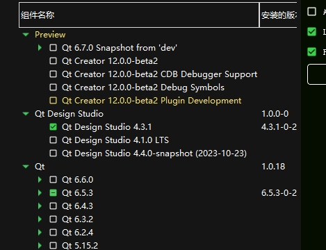
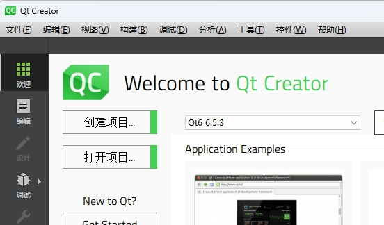
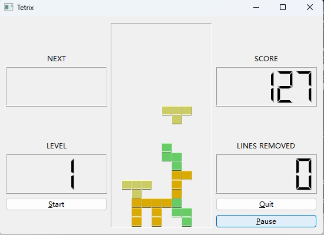
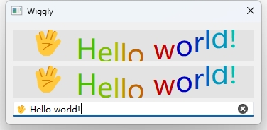

Title: Generates Python bindings for the Qt6 library with PySide6 on Windows 11
Date: 2023-11-01 10:53
Category: Qt
Tags: Qt, PySide6, Python

> This blog is a companion piece to my early blog [Generates Python bindings for the Qt6 library with PySide6 on MacOS](https://callmenezha.github.io/generates-python-bindings-for-the-qt6-library-with-pyside6-on-macos.html), but on Windows 11 with several setup changes.

I've been using PyQt5 for years which is de facto standard Qt python binding library until PySide2 has been offically 
announced up by the Qt Company in year of 2018. Five years on, I think PySide is mature enough to be used in production
environment. This post request you to have C++ and compiler toolchain knowledge, since I won't explain much about details of CMake syntax and C++ build system.

# Walkthrough examples on Windows 
## Install Qt environment

If you won't modify Qt C++ source, it is recommanded to install Qt pre-build by download qt installer online and install 
Qt by clicking next till end. Intaller can be download under https://www.qt.io/download-open-source.

> CAUTION: You MUST install Qt same version as PySide! Otherwise the abi consistancy is doomed.

The latest Qt version at the time of writing is 6.5.3 , we will stick to this version here.



You can check which version of Qt you have installed on system.


If you can see Qt installed under `C:\Qt\6.5.3`, it means you can proceed.

## Requirements

* Visual Studio 2019 with C++ tool chains.
* CMake == 3.26.4 (de facto cross-platform C/C++ build system for other build systems)
* Ninja == 1.10.2 (the famous tool `make`'s modern alternative)
* `sphinx` package for the documentation (optional).

I am get used to `Anaconda` environment, its the same of you to use `virtualenv`.

Create a new python environment using Python 3.11 (PySide6 only supports Python > 3.8 and it's no difference to use 
3.9, 3.10, 3.11), I use 3.11 because it is latest Python version at the time of writing.

```bash
conda create --name pyside python=3.11
conda install ninja
conda install cmake
ninja --version
cmake --version
```

If everything works fine and no output complains about missing something then you can proceed.

## (Option 1) Install PySide6! 

There is easy way and hard way to install PySide6 in your python environment.

1. Easy way: `pip install PySide6`. Done!
2. Hard way: Man you are brave enough! Lets do this.

## (Option 2) Download PySide source code and build from source! 

### 1. Install Visual Studio 2019 64bit and C++ toolchain as needed.
> Download Visual Studio 2019 online installer and install it on your computer.

#### Add Visual Studio 2019 compiler launcher path to system enviroment variable `Path`.
> Add "C:\Program Files (x86)\Microsoft Visual Studio 14.0\VC\bin" at tail of variable `Path` in system enviroment for `CMake` to find proper compiler paths.

### 2. Install Qt and don't forget install source code as well.
> Download Qt online installer and install it on your computer, in customize option click `source code` it will download source code besides binary files.

#### Add Qt install path to system environment variable `Path`.
> Add "C:\Qt\6.5.3\msvc2019_64\bin" at tail of variable `Path` in system enviroment for `CMake` to find proper Qt include and library cmake paths.

### 3. Download and setup Clang which used for C++ python binding generation.
```bash
wget https://download.qt.io/development_releases/prebuilt/libclang/libclang-release_140-based-macos-universal.7z
```

> Extract the files, and leave it on any desired path, and set the environment variable required:

```bash
7z x libclang-release_140-based-macos-universal.7z
set LLVM_INSTALL_DIR=$PWD/libclang
```

> Or add environment variable named `LLVM_INSTALL_DIR` and set its value to `C:\lib\libclang-release_17.0.1-based-windows-vs2019_64\libclang` ('C:\lib\' is the folder where I extracted the compressed 7z file to)


### 4. Setup conda environment for pyside compilation:
```bash
conda create --name pyside python=3.11
```

#### Install cmake, ninja, numpy
```bash
conda install cmake
conda install ninja
conda install numpy
```

### 5. Cloning the official repository can be done by:
```bash
git clone https://code.qt.io/pyside/pyside-setup
```

#### Checking out the version that we want to build, for example, 6.5.3:
```bash
cd pyside-setup && git checkout 6.5.3
```

#### Install the general dependencies:
```bash
pip install -r requirements.txt
```

> NOTE: Keep in mind you need to use the same version as your Qt installation

### 6. Building PySide

Check your Qt installation path, to specifically use that version of qtpaths to build PySide. for example, `C:\Qt\6.5.3\msvc2019_64\bin\qtpaths.exe`. (This `qtpaths` is a small program to get locations of Qt)

Build can take a few minutes, so it is recommended to use more than one CPU core:

```bash
python setup.py build --build-tests --ignore-git --parallel=16
```

> My PC is equiped with AMD-7950X CPU it has 16-cores so i use `--parallel=16` here :P

### ISSUES THAT I came across.

#### 1. UnicodeDecodeError: ‘gbk‘ codec can‘t decode byte.
```bash
UnicodeDecodeError: 'gbk' codec can't decode byte 0x82 in position 2202: illegal multibyte sequence
Traceback (most recent call last):
  File "C:\Users\Admin\Dev\pyside-setup\setup.py", line 42, in <module>
    setup_runner.run_setup()
  File "C:\Users\Admin\Dev\pyside-setup\build_scripts\setup_runner.py", line 207, in run_setup
    self.run_setuptools_setup()
  ...
  ...
  ...
    qt_target_mkspec_output = configure_cmake_project(
                              ^^^^^^^^^^^^^^^^^^^^^^^^
  File "C:\Users\Admin\Dev\pyside-setup\build_scripts\utils.py", line 1091, in configure_cmake_project
    m = _configure_failure_message(project_path, cmd, return_code,
        ^^^^^^^^^^^^^^^^^^^^^^^^^^^^^^^^^^^^^^^^^^^^^^^^^^^^^^^^^^
  File "C:\Users\Admin\Dev\pyside-setup\build_scripts\utils.py", line 1024, in _configure_failure_message
    error_text = indent(error.strip(), "    ")
                        ^^^^^^^^^^^
AttributeError: 'NoneType' object has no attribute 'strip'
Traceback (most recent call last):
  File "C:\Users\Admin\Dev\pyside-setup\setup.py", line 42, in <module>
    setup_runner.run_setup()
  File "C:\Users\Admin\Dev\pyside-setup\build_scripts\setup_runner.py", line 263, in run_setup
    raise RuntimeError(msg)
RuntimeError:
setup.py invocation failed with exit code: 1.
```

Because I use Chinese Simplified language on my computer, this is an known issue. You can just fix it by explicit creating the `Popen` with encoding as 'utf-8' or change `Popen` default init method n `subprocess.py`.


### Tips of pakcage installation. 

After you have built PySide2 project successfully, you will get Official PySide6 package under `qfp-py3.11-qt6.5.3-64bit-release` 
folder in `build` we create early. There is a lot of `Qt*.dll` in `package/PySide6` that ready to be imported by your 
python script.

But before we use PySide6 in our python script, we must first install them into our `site-packages` for python 
executable to find. 

> You can use `python setup.py --help` to see the usage of commandline of setup tool.
> Or use `python setup.py --help-command` to see detailed argument usage.

The setup commandline tool is powerful, it can generate egg files, wheels and dist-info folder for package distribution. 
But here we just use `python setup.py install --build-tests --ignore-git --parallel=16` to install package with dist-info(stores meta information of package for usage).


## Test PySide6 installation

You can execute one of the examples to verify the process is properly working. Remember to properly set the environment variables for Qt and PySide:

```bash
python examples\widgets\widgets\tetrix\tetrix.py
```



## Write C++ generate Python bindings for usage.

### Level 1: Generate Python bindings for a non-Qt C++ library

> https://doc.qt.io/qtforpython-6/examples/example_samplebinding_samplebinding.html

There is a demo of non-Qt C++ library Python binding generation called `samplebinding` located at `PySide/examples/samplebinding`. 

You can practice this demo by reading the documentation under the folder `samplebinding/doc/samplebinding.rst`.

If you walkthrough the hard trip and built PySide6 your self, your toolchain environment is well 
configured to work properly on this demo. But if you install PySide6 using PIP, then you will need to install 
`shiboken6-generator` which can't be install throgh PIP and isn't included in the `PySide6` PIP installation. 
`shiboken6-generator` package wheel can be manually downloaded from website https://download.qt.io/official_releases/QtForPython/shiboken6-generator/ . Using `pip install shiboken6_generator-6.5.3-cp37-abi3-win_amd64.whl` 
to install.

> If you build PySide6 from sources, besides `PySide6`, `shiboken6` and `shiboken6-generator` will also be compiled and 
> installed from source.


## Level 2: Make a Qt C++ application scriptable

> https://doc.qt.io/qtforpython-6/examples/example_scriptableapplication_scriptableapplication.html

This example demonstrates how to make a Qt C++ application scriptable.
The exmaple document is really detailed, so you can walkthrough it easily.
In the end you will get a `scriptableapplication` which can be runned as an executable program.

This example is exactly the opposite of example "Level 1: Generate Python bindings for a non-Qt C++ library".

In previous example, we compile C++ into dynamic shared library together with loadable module and use C++ objects in 
Python runtime environment. But in this example, the direction is the opposite, it compiles C++ application and link 
against python library, embed python runtime context in it, so the Qt application actually invokes Python script.

## Level 3: Generate Python bindings for a Qt C++ library

Amazingly, we've gotten this far, and it's time to treat ourselves a little bit with a cup of coffee.

> This URL https://doc.qt.io/qt-6/qtwidgets-widgets-wiggly-example.html given in README is 404 not found now. 
> So lets explore it on our own.

According to README of this example, it shows how to interact with a custom widget from two
different ways:

 * A full Python translation from a C++ example,
 * A Python binding generated from the C++ file.

We only focus on the second in this post.

### Following the steps to build the bindings in README

> The most important files are:
> * `bindings.xml`, to specify the class that we want to expose from C++
>   to Python,
> * `bindings.h` to include the header of the classes we want to expose
> * `CMakeList.txt`, with all the instructions to build the shared libraries
>   (DLL, or dylib)
> * `pyside_config.py` which is located in the utils directory, one level
>   up, to get the path for Shiboken and PySide.

> Now create a `build/` directory, and from inside run `cmake` to use
> the provided `CMakeLists.txt`:

> macOS/Linux:
> ```bash
> cd ~/pyside-setup/examples/widgetbinding
> ```

> On Windows:
```bash
cd C:\pyside-setup\examples\widgetbinding
mkdir build
cmake -H.. -B. -G "Visual Studio 16 2019" -DCMAKE_BUILD_TYPE=Release -DCMAKE_OSX_ARCHITECTURES=x86_64
msbuild wiggly.sln /property:Configuration=Release
cd ..
copy build\Release\wiggly.pyd  . /Y
copy build\Release\libwiggly.dll  . /Y
python main.py
```

### Result: Congratulations Hello PySide6 from C++!

```bash
cmake -H.. -B. -G "Visual Studio 16 2019" -DCMAKE_BUILD_TYPE=Release -DCMAKE_OSX_ARCHITECTURES=x86_64
msbuild wiggly.sln /property:Configuration=Release
cd ..
copy build\Release\wiggly.pyd  . /Y
copy build\Release\libwiggly.dll  . /Y
python main.py
```




