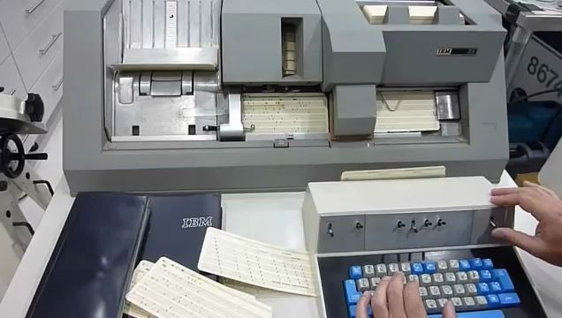
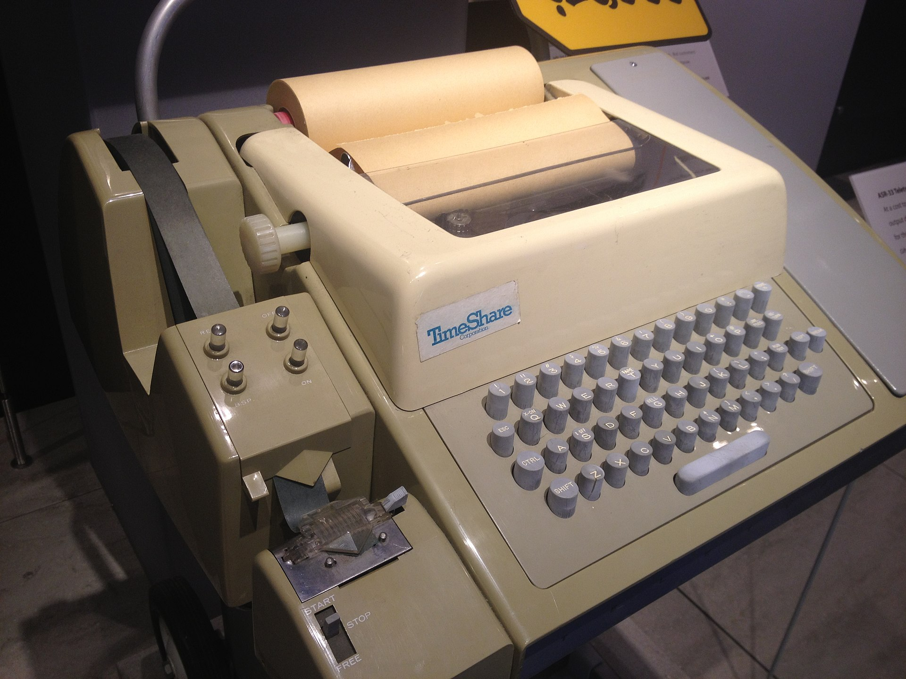
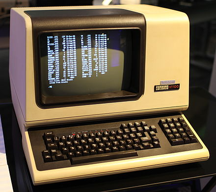
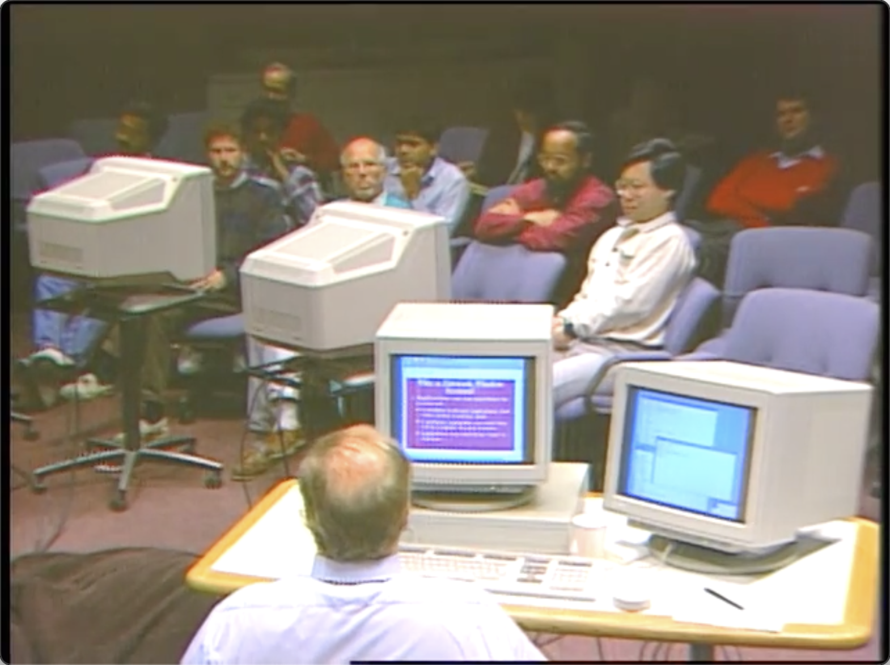
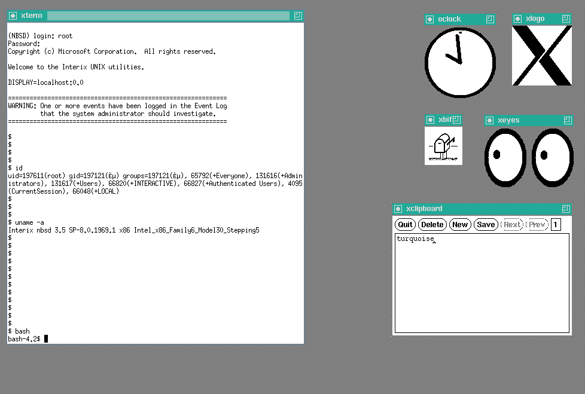

Title: Learn X11.
Date: 2023-07-25 11:31
Category: Linux
Tags: Linux, X Window System

X11 is a very old, so old that it runs almost on every 100% Linux desktop distribution (1984-2023, last stable release is 11 years old, X11R7.7 / 6 June 2012 according to Wikipedia).

So Wayland is coming along the road, everybody(ok, almost everybody) think Wayland is the future, why we need to learn X11 at present? Because as we said, it still runs almost on 100% Linux desktop distribution as default display server. And because creation of anything cannot escape its historical reasons, if you want to fully understand the problems Wayland is solving, it is recommanded looking back to its ancestor X11.

## What is window system?

Before people get used to graphical desktop display on LCD screen or CRT, there is a long history of computer displaying system evolving from hole puncher, paper printer to famous video terminal VT100 which can only display 24x80(24 rows, 80 characters) green characters on the screen until graphical user interface came in.

Photo of the hole-punch computer released by IBM in 1964. Now you could write the program (punch holes in the tape), input the program (put the tape into the reader) and have the computer read the results from the punched tape, of course in digits. The REPL (read eval print loop) is working! And the program has an entity... Cool... People used hole-punch method almost half a century.

Photo of the teleprinter(teletypewriter, teletype or TTY) (yeh, this the thing Linux I/O files tty0~tty8 , ttyUSB0, tty... named of) Teletype Model 33 ASR, with punched tape reader and punch, usable as a computer terminal.

Photo of video terminal VT100, a text display with 80 columns and 24 rows.

Photo of  a lecture by James Gettys. This video has been recorded on February, 1991. 

It can be seen that the graphical desktop of the system has not changed much in 30 years.

Back to the title, the window system is a windowing system for bitmap displays, provides the basic framework for a GUI environment: drawing and moving windows on the display device and interacting with a mouse and keyboard, because we can have multiple windows layout on the screen displaying different types of contents. 

## Before the Linux desktop is working

Remember this, a Linux system doesn't need a desktop to work, a desktop is just a bunch of programs running to decorate your screen and allow you to work comfortably.

