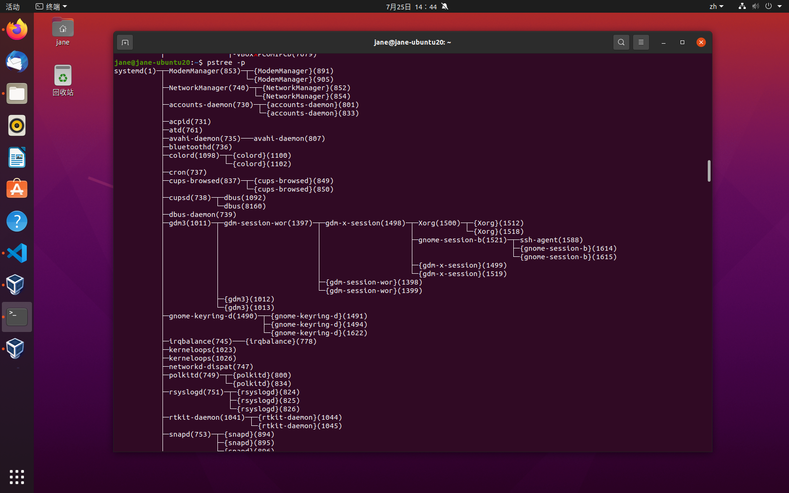
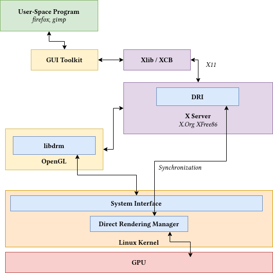
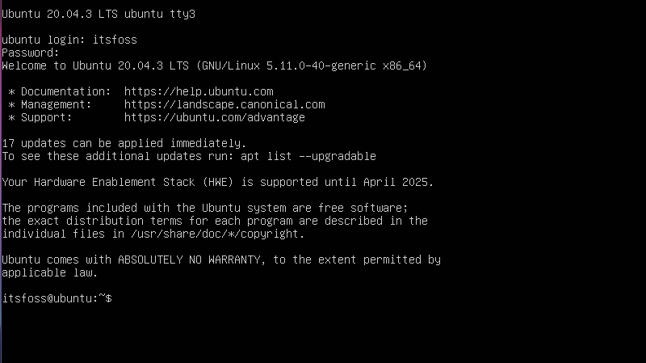
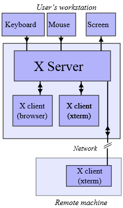
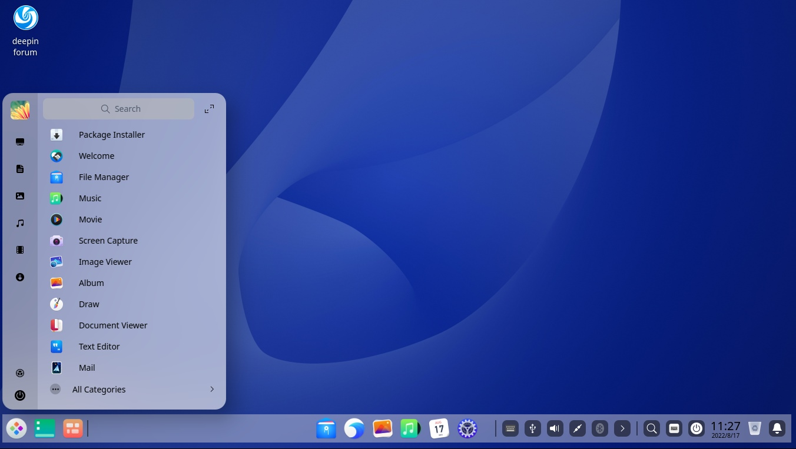
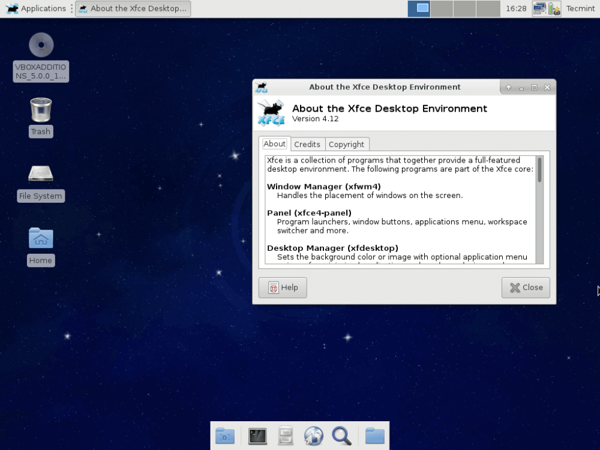

Title: Learn X Window System.
Date: 2023-07-25 11:31
Category: Linux
Tags: Linux, X Window System

X11 is a very old, so old that it runs almost on every 100% Linux desktop distribution (1984-2023, last stable release is 11 years old, X11R7.7 / 6 June 2012 according to Wikipedia).

So Wayland is coming along the road, everybody(ok, almost everybody) think Wayland is the future, why we need to learn X Window System at present? Because as we said, it still runs almost on 100% Linux desktop distribution as default display server. And because creation of anything cannot escape its historical reasons, if you want to fully understand the problems Wayland is solving, it is recommanded looking back to its ancestor X.

## What is window system?

Before people get used to graphical desktop display on LCD screen or CRT, there is a long history of computer displaying system evolving from hole puncher, paper printer to famous video terminal VT100 which can only display 24x80(24 rows, 80 characters) green characters on the screen until graphical user interface came in.

Photo of the hole-punch computer released by IBM in 1964. Now you could write the program (punch holes in the tape), input the program (put the tape into the reader) and have the computer read the results from the punched tape, of course in digits. The REPL (read eval print loop) is working! And the program has an entity... Cool... People used hole-punch method almost half a century.


Photo of the teleprinter(teletypewriter, teletype or TTY) (yeh, this the thing Linux I/O files tty0~tty8 , ttyUSB0, tty... named of) Teletype Model 33 ASR, with punched tape reader and punch, usable as a computer terminal.


Photo of video terminal VT100, a text display with 80 columns and 24 rows.


Photo of  a lecture by James Gettys. This video has been recorded on February, 1991. 


It can be seen that the graphical desktop of the system has not changed much in 30 years.

Back to the title, the window system is a windowing system for bitmap displays, provides the basic framework for a GUI environment: drawing and moving windows on the display device and interacting with a mouse and keyboard, because we can have multiple windows layout on the screen displaying different types of contents. 

## Before the Linux desktop is working.

Remember this, a Linux system doesn't need a desktop to work, a desktop is just a bunch of programs running to decorate your screen and allow you to work comfortably.

Let's see the X Window System processes runned on Ubuntu20.04.


You can see all the Xorg related processes spawned by `gdm3` which is GNOME display manager aka desktop environment responsible for managing desktop displaying stuff. 

```
           ├─gdm3(1011)─┬─gdm-session-wor(1397)─┬─gdm-x-session(1498)─┬─Xorg(1500)─┬─{Xorg}(1512)
           │            │                       │                     │            └─{Xorg}(1518)
           │            │                       │                     ├─gnome-session-b(1521)─┬─ssh-agent(1588)
           │            │                       │                     │                       ├─{gnome-session-b}(1614)
           │            │                       │                     │                       └─{gnome-session-b}(1615)
           │            │                       │                     ├─{gdm-x-session}(1499)
           │            │                       │                     └─{gdm-x-session}(1519)
           │            │                       ├─{gdm-session-wor}(1398)
           │            │                       └─{gdm-session-wor}(1399)
           │            ├─{gdm3}(1012)
           │            └─{gdm3}(1013)

```

If you enter coomand `sudo pkill X` in terminal it will killall X window manager processes found in this session. And the screen will blackout for several seconds then turn you back into login page (because in system startup script there is an infinite loop to reboot desktop environment in case of accidentally crash of desktop program).

> Wait a second! What is X.org?

Like all the great works began with protocol design. X11 is just the network protocol that’s responsible for delivering payloads between an X Client (application) and an X Server (display). These messages typically carry primitive drawing commands like "draw a white box", "write these characters at this position", "the left button is clicked" etc. Fundamentally, X is a family of protocols, whereas X11 is the 11th version of the X protocol. X.org on the other hand is the software implemention of X protocol.




> X11 is an extensible protocol. Therefore, developers can easily add additional features to the protocol without breaking the existing clients.
> By design, X11 is network-transparent. This allows the possibility of running the client and the server either on the same machine or different ones. A client and a server can also communicate over the Internet through an encrypted network session.
> On the same host, these messages are delivered through UNIX sockets for efficient communication.

It is worth mentioned that, depends on different Linux distributions configuration, there are at least 3-4 number of non-graphical sessions you can use after system boot by default, check out how many TTY has been created, you can goto `/dev` directory, there must be files named `tty1`, `tty2`~`tty[N]`. My `Ubuntu 20.04 LTS` uses `tty1` and `tty2` as desktop sessions where window manager runs and from which we login, `tty3`~`tty6` are the non-graphical sessions. You can press `Ctrl+Alt+F3` to checkout `tty3`(suddenly back to 1990), don't panic when desktop disappears, you can always press `Ctrl+Alt+F2` to switch back. 




## Why X is a server?
> If there is a competition resource, there requires a server to manage it.

The screen clearly becomes a competitive resource that all applications want to take advantage of. A compositor must needed to draw every application pixmap into their own rectangle window and deal with overlap, moving, resizing stuff. In face, the word compositor is an alias of display manager in the communication of developers.



So where is UI application draw into is called off-screen buffer which is just a memory allocated to application as a canvas.


As you can see, its distributed C/S(client server) architecture design allows the user application running on remote machine and X11 messages sends between client and server.


## Why there are so many Desktop Distributions and Window Managers?

> In the Linux world, if you don't like it, you can replace it, not to mention everyone's different appreciation of beauty. 

As X server is only responsible for event handling and displaying, there is a huge space for desktop developers/team/publisher to work on and distribute different styles of window frames, docks, menubars and widgets to fullfill everyone's needs, some are fancy like DeepIn, some are unpretentious like Xfce. 
And window manager is just another program resides outside X server to provide window dragging, resizing, overlaping, window appearance management functionalities.




## Conclusion
In conclusion, learning the X Window System (X11) is still relevant and valuable despite the emergence of newer display servers like Wayland. X11 continues to be the default display server for almost all Linux desktop distributions, making it essential for understanding and configuring graphical environments effectively. Its historical significance and widespread usage provide valuable insights into the evolution of graphical user interfaces and the problems that newer display servers aim to solve.

Moreover, X11's network-transparent design allows applications to run on remote machines, making it suitable for distributed computing scenarios. Additionally, the extensive customizability of X11 has led to a diverse range of desktop environments, window managers, and user interface styles, offering users various options to suit their preferences.

While Wayland and other newer display servers are gaining popularity, X11's presence in the Linux ecosystem remains substantial. Therefore, familiarizing oneself with X11 is a beneficial endeavor, especially for Linux enthusiasts, developers, and anyone interested in computer graphics and graphical user interfaces.